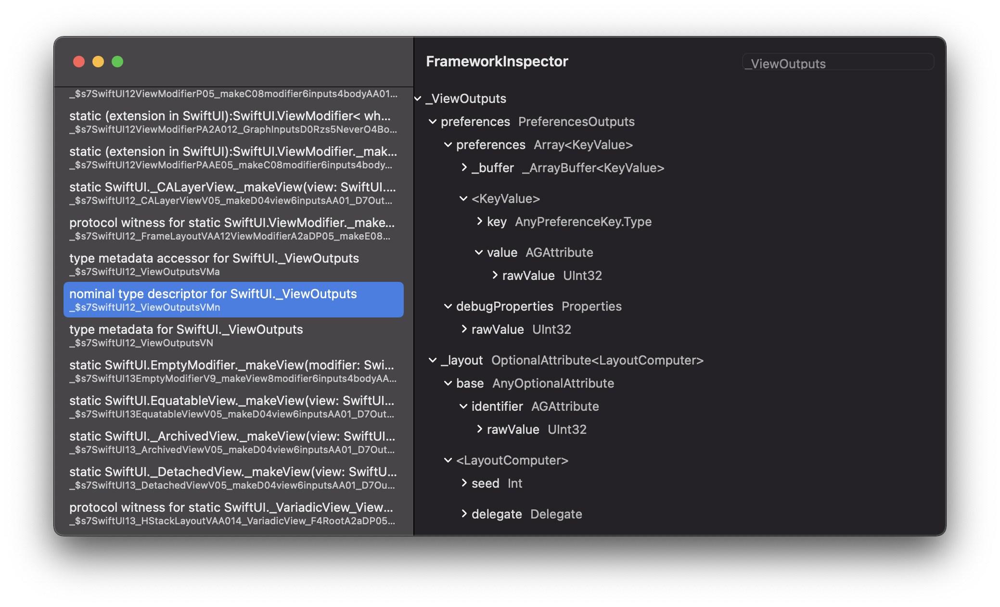

# Framework Inspector

> View the internals of Swift frameworks

## Usage

> *NOTE*: If the framework you are trying to inspect is not linked, it won't be able to find the type information.
  Be sure to add the framework to the `Frameworks, Libraries, and Embedded Content` field in the `xcodeproj`.

Let's say we want to have a look around the internals of SwiftUI:

* Press `Choose .tbd` and navigate to the `.tbd` file. You can find a `.tbd` file for SwiftUI at `/Applications/Xcode.app/Contents/Developer/Platforms/iPhoneOS.platform/Developer/SDKs/iPhoneOS.sdk/System/Library/Frameworks/SwiftUI.framework/SwiftUI.tbd`
* The symbols should load into the sidebar. You can search for a specific symbol with the searchbar in the top right corner. For instance, we can search for `nominal type descriptor for SwiftUI.Text`
* After choosing a symbol, the type information is loaded on the right side. In this case, we can see that `SwiftUI.Text` keeps an array of `Modifier`s, which is an enum with the various `Text` modifiers available.
